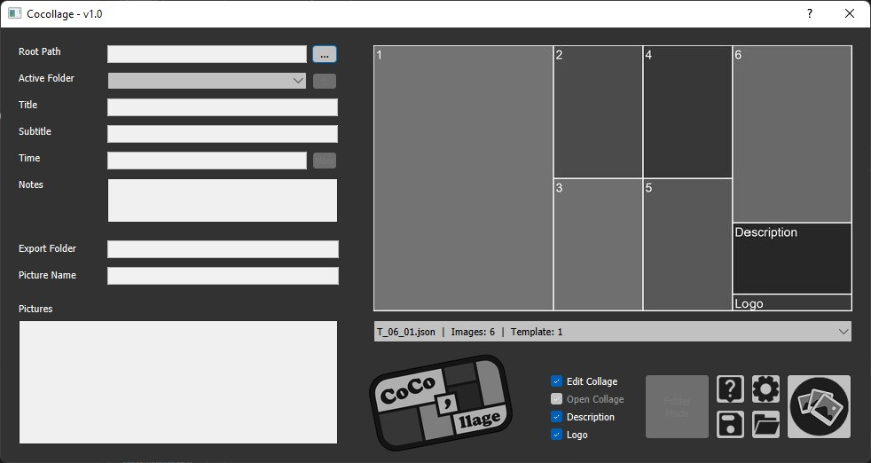
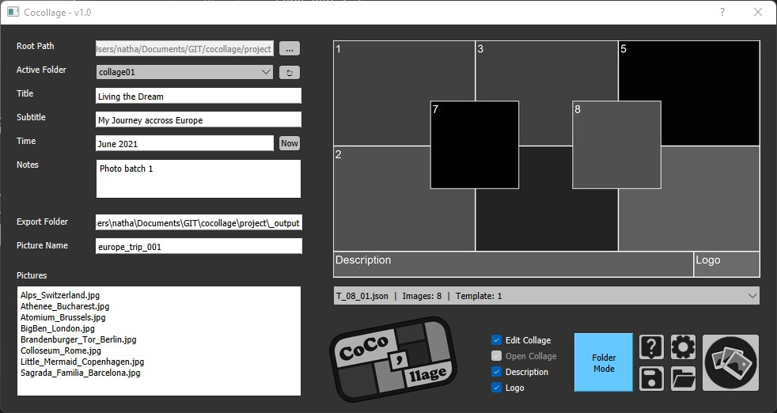
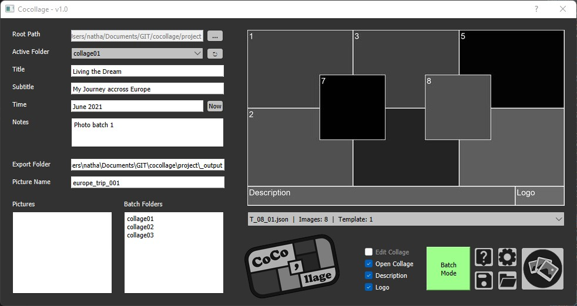
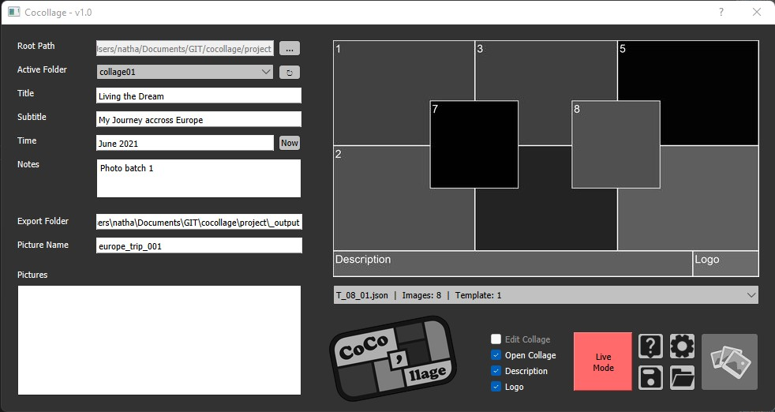

# CoCo'llage
*A simple and flexible tool to create image collages. Batchable, processing in real-time and offering customized templates.*


Current Version: 1.0, February 2022.

<p align="center"></p>

## Description
Coco'llage allows you to create a collage of jpg/png pictures using an infinity of templates the user can define himself in json files. A Batch mode offers to create collages from multiple directories. A Live mode offers to create collages in real-time, every time a new folder is found. Collages can be further edited using keyboard/mouse functions like Pan and Zoom to better position and frame the pictures. Most of the settings used can be accessed and modified in a json file (colors, borders, picture size, frame, etc.)

## Installation
CoCo'llage relies on Python3 and the PyQt5, Pillow and additional libraries.

+ Download or clone repository
+ Install required libraries from requirements.txt.
+ Start main.py
```
pip install -r requirements.txt
python main.py
```
Additionnaly you can use INSTALL.BAT to create a virtual environment containing all required libraries and START.BAT to start the script.

## Interface
<p align="center"></p>

**LEFT PANEL**
+ **Root Path / Browse Button**: Browse to the root folder containing your collage(s). Each collage should be in a subfolder inside the root.
+ **Active FOlder / Update Button**: Displays a list of subfolders found inside the root. Select the one you want to process. Update the list if needed.
+ **Title**: Give a title to your collage (optional)
+ **Subtitle**: Give a subtitle to your collage (optional)
+ **Time / Now Button**: Give a date/time to your collage (optional). Insert current date/time if needed.
+ **Notes**: Add notes to your collage (optional)
+ **Export Folder**: Specify path where to save collage (optional, 'root/_output' by default)
+ **Picture Name**: Specify collage name (optional, 'collage_date_time.png by default')
+ **Pictures**: Selected pictures (optional, all pictures from the active folder will be used if not specified)
+ **Batches**: Only in Batch Mode. Selected batches to process from the root.

**RIGHT PANEL**
+ **Template Selection**: Template json file that should be used to make the collage. A preview PNG picture is automatically generated if it does not exists in the template folder.
+ **Edit Collage**: Opens the collage in Edit Mode to pan/zoom the pictures and add borders. An unedited collage with default-size pictures will be saved if unchecked. Unchecked by default in Batch or Live Modes.
+ **Open Collage**: Opens the collage after creation. Checked by default in Edit Mode.
+ **Description**: Show or hide the description from the collage.
+ **Logo**: Show or hide the logo from the collage. The path to the logo is specified in the settings.json file. The default CoCo'llage logo will be used by default.
+ **Mode Button**: Switches between the 3 creation modes: Folder/Batch/Live.
+ **Help Button**: Opens the GitHub project page and documentation.
+ **Settings Button**: Opens the settings.json file to edit the settings.
+ **Save Button**: Save to save.json all UI fields and options.
+ **Load Button**: Load all UI fields and options from save.json.
+ **Create Collage**: Start the creation process.

## Folder Mode
<p align="center"></p>

This is the default mode at startup. It lets you process one collage at a time. Proceed as follows:
1. Browse to the root folder containing your collage. The images should be inside a subfolder of the root.
2. Select the desired subfolder from the Active Folder dropdown list
3. Fill up information about your collage (optional). They will appear on the final picture in the Description area
4. Precise an Export Folder and a Picture Name (optional)
5. Input the full name + extension (separated by a line break) of the pictures you want to process in the Pictures field. You can also drag-and-drop the them directly inside
6. Select the desired template. It should match the number of pictures specified in the Pictures field. If no pictures are specified, all pictures from the active folder and a matching template will be used
7. Select desired options
8. Start Collage

If the **Edit Collage** option is checked, an interactive preview will open where you can edit your collage using the following shortcuts:
* Left Mouse Button: Pan picture inside its slot
* Mouse Wheel: Zoom in and out on picture inside its stot
* Right Mouse Button: Reset picture size
* Middle Mouse Click: Add borders
* Double Click: Save picture
* Escape key: Close preview

## Batch Mode
<p align="center"></p>

This mode is similar to the Folder Mode but will run the collage creation over multiple batches. Proceed as in Folder Mode. In the Batch Folder field, input the name of each subfolder (separated by a line break) containing pictures that should be processed. You can also drag-and-drop folders directly inside the field. If you want to process certain pictures only, you can specify their full name + extension or drag-and-drop them in the Pictures field. Be careful that these picture name should be the same in all processed subfolders. Start the Collage process. The script will batch process all specified subfolders.

The Edit Collage option is not available in this mode. Collages are created using the picture's full size.

## Live Mode
<p align="center"></p>

This mode is similar to the Folder Mode but is working in real time. Once selected, the script will list all available subfolders inside the root folder. Every time a new folder containing pictures is created, it will process it automatically and export a collage picture. Note that the Edit Collage option is not available in this Mode.

## Settings

The file settings.json, also accessible via the Gear Icon, allows you to modify some settings that are used inside the script.

```json

{	
    "DEFAULT_ROOT_FOLDER": "project",
    "COLLAGE_WIDTH": 1920,
    "COLLAGE_HEIGHT": 1080,
    "TEXT_FONT": "data/arial.ttf",
    "TEXT_SIZE": 30,
    "TEMPLATE_DIR": "templates",
    "TEMPLATE_DEFAULT": "T_06_01",
    "COCO_LOGO": "data/coco_logo.png",
    "UI_LOGO": "data/coco_ui.png",
    "BORDER_WIDTH": "10px",
    "PIC_EXTENSION": [".jpg",".png"],
    "BKG_COLOR": [24,24,24],
    "TEXT_COLOR": [255,255,255],
    "BORDER_COLOR": [24,24,24]
}
```
+ **DEFAULT_ROOT_FOLDER**: Default path opened when browsing for the root
+ **COLLAGE_WIDTH/COLLAGE_HEIGHT**: Collage size (pix)
+ **TEXT_FONT/TEXT_SIZE**: Font used for the description and size
+ **TEMPLATE_DIR/TEMPLATE_DEFAULT**: Path to templates folder and default template used at startup
+ **COCO_LOGO/UI_LOGO**: Paths to logos used in the collage and in the UI
+ **BORDER_WIDTH**: Size (pix) of pictures borders in Edit Collage
+ **PIC_EXTENSION**: Extensions supported for the input pictures
+ **BKG_COLOR/TEXT_COLOR/BORDER_COLOR**: RGB colors of collage's background, text and borders

## Save/Load

You can save the current state of the UI using the Save function (Floppy Icon). Data are saved in the save.json file.
You can retrieve this data at any time using the Load function (Folder Icon). Data are read from the save.json file.
You can edit the contents of the save.json file. Just be careful not to alter the json file format.

## Template Creation
CoCo'llage is a flexible tool that let you create your own template. For this you will need to create a new json file based on the other template's structure, as follows.

```json
{
  "1": [0, 0, 720, 1080],
  "2": [720, 0, 360, 540],
  "3": [720, 540, 360, 540],
  "4": [1080, 0, 360, 540],
  "5": [1080, 540, 360, 540],
  "6": [1440, 0, 480, 720],
  "Description": [1440, 720, 480, 290, "{title}\n{subtitle}\n{time}\n{notes}"],
  "Logo": [1440, 1010, 480, 70]
}
```
Specify as Key your picture number (from 1 to n for an n-picture collage) and as value an array of 4 values:
coordinate of the top-left pixel (x, y), picture width, picture height.

To define the description area, use the same convention with "Description" as key and a 5th element in the array, formatting the description. {title}, {subtitle}, {time} and {notes} keywords will be replaced with the corresponding entries.

The Logo area is defined like a picture, with the "Logo" key.

Templates should be saved inside the templates folder, or any folder specified in the settings.json. The naming convention should be preserved:
```
T_[Number of pictures, 2 digits]_[template identifier, 2 digits]
Example: T_06_01, for a 6-picture template 
```
The identifier allows to create multiple templates using the same amount of pictures.

If the new template is a valid json file (beware the format), it will appear in the drop down list of templates. As soon as selected, a jpg picture will be generated, showing a preview of the new template. Feel free to replace these png pictures with real collages, to be used as new previews.

<p align="center"></p>

## Current limitations and improvements

Following limitations should be fixed in a future version:
+ The collage resolution is limited to 1920 x 1080, due to how templates are defined in the json files. Images coordinates and size should be adjusted for different collage resolutions.
+ Only PNG and JPG pictures are supported as input for now
+ The Description size and format should be adjusted to match the description area
+ The UI does not display correctly on Windows displays with a scale factor (e.g. 150%). The Edit Collage option also does not display the collage properly, forcing you to switch back to 100%.

Following features should be considered to improve functionnality:
+ The Edit Collage option is only available in Folder Mode. It would be nice to be able to save the pan and zoom offsets and reuse them automatically in Batch and Live Modes.
+ If the Edit Collage option is off, the full images are inserted inside the collage, resulting in black borders. Images should ideally fill up their area as best while keeping aspect ratio
+ In Batch Mode, it is not possible to specify different Pictures to process for each batch. The Batch Folders field should ideally be interactive and offer the possibility to specify different picture names for each batch.
